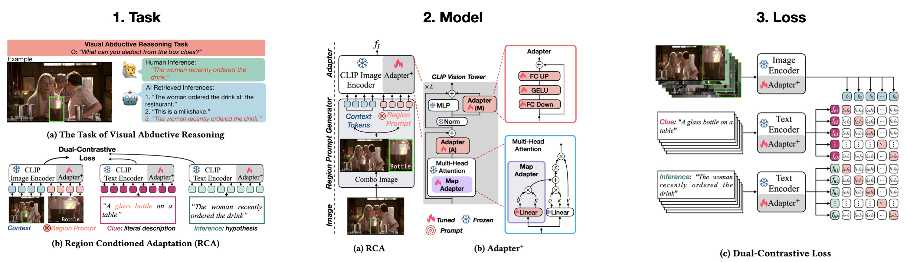

# RCA: Region Conditioned Adaptation for Visual Abductive Reasoning (ACM Multimedia 2024)

This is the official implementation of the paper [RCA: Region Conditioned Adaptation for Visual Abductive Reasoning](https://arxiv.org/pdf/2303.10428). We achieved the top rank on the official Sherlock Abductive Reasoning [Leaderboard](https://leaderboard.allenai.org/sherlock/submissions/public) and the DHPR retrieval performance.

<div align="center">
  
</div>

- [Updates](#updates)
- [Model Zoo](#model-zoo)
- [Installation](#installation)
- [Quick Start](#quick-start)
- [Contributors](#contributors)
- [Citing](#citing)
- [Acknowledgement](#Acknowledgement)

### July 19, 2024
* Release RCA-V1 version (the version used in paper) to public.

## Model Zoo
| Model | Backbone | Tuned (M↓) | im→txt (↓) | txt→im (↓) | P@1→I (↑) | GT/Auto-Box (↑) | Human Acc (↑) | Model Link |
|----------|------------|-----------|--------------|-------------|------------|-------------|-------------|-------------|
| LXMERT [1] from [4] |  F-RCNN  | NA | 51.10 | 48.80 | 14.90 | 69.50 / 30.30 | 21.10 |NA|
| UNITER [2] from [4]  |  F-RCNN  | NA | 40.40 | 40.00 | 19.80 | 73.00 / 33.30 | 22.90 |NA|
| CPT [3] from [4]    | RN50×64  | NA | 16.35 | 17.72 | 33.44 | 87.22 / 40.60 | 27.12 |NA|
| CPT [3] from [4]    | ViT-B-16 |149.62 | 19.85 | 21.64 | 30.56 | 85.33 / 36.60 | 21.31 |[pth]()|
| **RCA + Dual-Contrast Loss** | ViT-B-16 |**42.26** | 13.92 | 16.58 | 35.42 | 88.08 / 42.32 | **27.51** |[pth]()|
| CPT [3] (our impl) | ViT-L-14 |428.53 | 13.08 | 14.91 | 37.21 | 87.85 / 41.99 | 29.58 |[pth]()|
| **RCA + Dual-Contrast Loss**  | ViT-L-14 | **89.63** | 10.14 | 12.65 | 40.36 | 89.72 / 44.73 | **31.74** |[pth]()|

[1. LXMERT](https://aclanthology.org/D19-1514.pdf)
[2. UNITER](https://www.ecva.net/papers/eccv_2020/papers_ECCV/papers/123750103.pdf)
[3. CPT](https://arxiv.org/pdf/2109.11797)
[4. SHERLOCK](https://www.ecva.net/papers/eccv_2022/papers_ECCV/papers/136960549.pdf)

## Installation
```
cd train_code_v2.20.0_RCA_CLIP
pip install -r requirements.txt
```
## Quick Start
### Train
#### Pre-pare data
Create a folder named `Sherlock` and put the following files in it:
```
Sherlock
|_sherlock_val_with_split_idxs_v1_1.json
|_sherlock_train_v1_1.json
|
|_test_localization_public
|_test_retrieval_public
|_test_comparison_public
|_val_localization
|_val_retrieval
|_val_comparison
|
|_images
  |_vcr1images
  |        |_vcr1images_0.jpg
  |        |_...
  |
  |_VG_100K
  |        |_vcr1images_1.jpg
  |        |_...
  |
  |_VG_100K_2
          |_vcr1images_2.jpg
          |_...
```
### Evaluate

## Contributors
RCA is coded and maintained by [Dr. Hao Zhang](https://hzhang57.github.io/).


## Citing
If you find the paper helpful for your work, please consider citing the following:

```
@inproceedings{hesselhwang2022abduction,
  title={{RCA: Region Conditioned Adaptation for Visual Abductive Reasoning}},
  author={Hao Zhang, Yeo Keat Ee, Basura Fernando},
  booktitle={ACM Multimedia},
  year={2024}
}
```

```
@inproceedings{hesselhwang2022abduction,
  title={{The Abduction of Sherlock Holmes: A Dataset for Visual Abductive Reasoning}},
  author={*Hessel, Jack and *Hwang, Jena D and Park, Jae Sung and Zellers, Rowan and Bhagavatula, Chandra and Rohrbach, Anna and Saenko, Kate and Choi, Yejin},
  booktitle={ECCV},
  year={2022}
}
```

```
@article{10568360,
  author={Charoenpitaks, Korawat and Nguyen, Van-Quang and Suganuma, Masanori and Takahashi, Masahiro and Niihara, Ryoma and Okatani, Takayuki},
  journal={IEEE Transactions on Intelligent Vehicles}, 
  title={Exploring the Potential of Multi-Modal AI for Driving Hazard Prediction}, 
  year={2024},
  volume={},
  number={},
  pages={1-11},
  keywords={Hazards;Cognition;Videos;Automobiles;Accidents;Task analysis;Natural languages;Vision;Language;Reasoning;Traffic Accident Anticipation},
  doi={10.1109/TIV.2024.3417353}
}

```
## Acknowledgement
Thanks for the following Github repositories:
- https://github.com/allenai/sherlock
- https://github.com/mlfoundations/open_clip
- https://github.com/DHPR-dataset/DHPR-dataset

